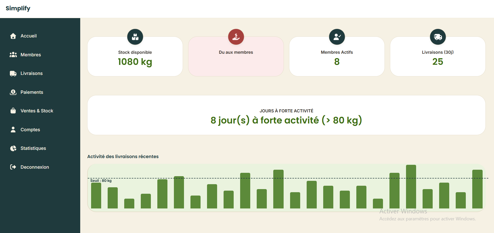

# Note de Branche / Changelog

## Informations Générales

- **Branche :** `feature/dashboard`
- **Auteur(s) :** @developpeur
- **Ticket / Issue :** #43

---

## Résumé des Modifications

Mise en place de la page d'accueil principale (Dashboard) avec la barre de navigation latérale (Sidebar), les cartes d'indicateurs KPI et le graphique d'activité des livraisons.

### Changements Techniques

- **Navigation (Sidebar) :**
  - Structuration de la navigation latérale fixe avec le logo **Simplify** en haut.
  - Intégration des liens de navigation avec leurs icônes Font Awesome (_Accueil, Membres, Livraisons, Paiements, Ventes & Stock, Comptes, Statistiques, Déconnexion_).
- **Cartes KPI (Indicateurs clés) :**
  - Création d'une grille réactive affichant 4 cartes principales : _Stock disponible (1080 kg)_, _Du aux membres_, _Membres Actifs (8)_ et _Livraisons (30j) (25)_.
  - Positionnement d'icônes circulaires centrées à cheval sur le bord supérieur de chaque carte.
  - Application d'un style d'alerte spécifique (`.debt-card`) en rouge/rose pour la carte "Du aux membres".
- **Section Synthèse & Graphique :**
  - Ajout du conteneur KPI mettant en valeur les _Jours à forte activité (8 jours > 80 kg)_.
  - Intégration du graphique en bâtons représentant l'activité des livraisons récentes.
  - Ajout d'une ligne de seuil horizontale pointillée (`::before` CSS) calée à 80 kg (`#primary`) pour repérer visuellement les pics d'activité.

---

## 📸 Captures d'Écran

---

## ⚠️ Points d'Attention / Impact

- [ ] Connecter la valeur du montant "Du aux membres" qui est actuellement vide sur la carte.
- [ ] Lier la route de déconnexion au mécanisme d'authentification.
- [ ] S'assurer du bon rendu responsive du layout sur écrans mobiles et tablettes.

---

## 🧪 Procédure de Test

1. Naviguer vers la route `/dashboard`.
2. Vérifier le bon survol des liens dans la sidebar.
3. Vérifier que la ligne de seuil "80 kg" croise correctement les barres du graphique.
