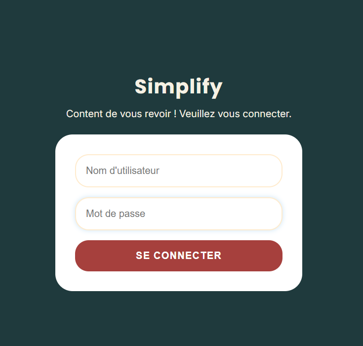

# Note de Branche / Changelog

## Informations Générales

- **Branche :** `feature/login`
- **Auteur(s) :** @ Val Pedro
- **Ticket / Issue :** #123

---

## 📝 Résumé des Modifications

_Création de l'interface d'authentification utilisateur ("Simplify") avec un formulaire épuré et centré._

### 🛠️ Changements Techniques

- **Front-end / HTML**
  - Intégration du formulaire de connexion avec un champ nom d'utilisateur et un champ mot de passe.
  - Ajout du titre de l'application **Simplify** et du message de bienvenue (_"Content de vous revoir ! Veuillez vous connecter."_).
  - Ajout du bouton d'action principal **SE CONNECTER**.

- **CSS / UI :**
  - Application d'un arrière-plan sombre pleine page avec alignement centré du conteneur.
  - Création de la carte de formulaire blanche avec coins arrondis (`border-radius`).
  - Stylisation des champs de saisie (_inputs_) avec bordures adoucies et effets d'arrière-plan légers.
  - Mise en forme du bouton d'action principal utilisant la couleur d'accentuation brique/terracotta (`#a6403d` / `--accent`) avec typographie en gras (`font-weight: 700`).

- **Javascript :** Ajout de la fonction (`validerFormulaireLogin`).

---

## 📸 Captures d'Écran / Démo

---

## ⚠️ Points d'Attention / Impact

- [ ] Connecter le formulaire à la route backend `/api/login`.
- [ ] Ajouter la gestion des erreurs de validation (ex: identifiants incorrects).
- [ ] S'assurer que les étiquettes (`<label>`) ou attributs `placeholder` / `aria-label` soient bien renseignés pour l'accessibilité.

---

## 🧪 Procédure de Test

1. Naviguer vers `/login`.
2. Saisir l'identifiant et le mot de passe dans les champs dédiés.
3. Cliquer sur le bouton **SE CONNECTER** pour soumettre le formulaire.
