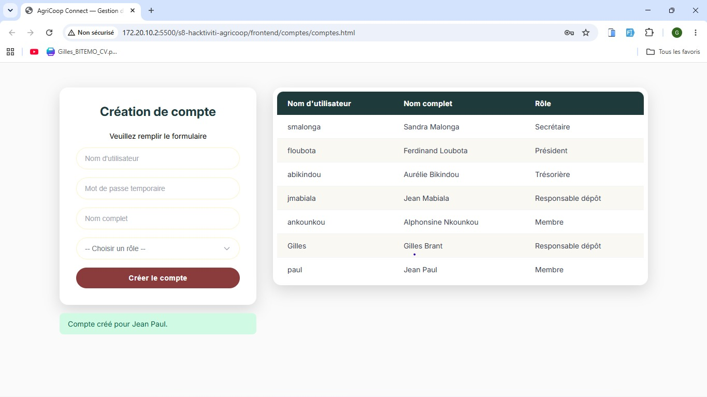

# Note de Branche / Changelog

## Informations Générales

- **Branche :** `feature/membres`
- **Auteur(s) :** Gilles Brant BITEMO

---

## Résumé des Modifications

Mise en place de la page d'enregistrement des membres  (Dashboard) avec la barre de navigation latérale (Sidebar), des option de recherche et de filtre , une liste de tout les membres enregistrer  

### Changements Techniques

- **Navigation (Sidebar) :**
  - Structuration de la navigation latérale fixe avec le logo **Simplify** en haut.
  - Intégration des liens de navigation avec leurs icônes Font Awesome (_Accueil, Membres, Livraisons, Paiements, Ventes & Stock, Comptes, Statistiques, Déconnexion_).
- **Cartes :**
  - Création d'un formulaire de creationde membres des membres avec validation des champs  .
  -  Option de filtrage des membre par statu
  -  rechercher   un  membre  par son nom,
  -  Liste des membres crees aves toutes les information du membre .
  - Application d'un style d'alerte spécifique  en rouge sur les données invalides .

---

## 📸 Captures d'Écran

---

## ⚠️ Points d'Attention / Impact

-  possibiliter de filter les membre 
- [ ] S'assurer du bon rendu responsive du layout sur écrans mobiles et tablettes.

---

## 🧪 Procédure de Test

1. Naviguer vers la route `/membres`.
2. Vérifier le bon survol des liens dans la sidebar.
3. creer un nouveau , rechercher   un  membre 
